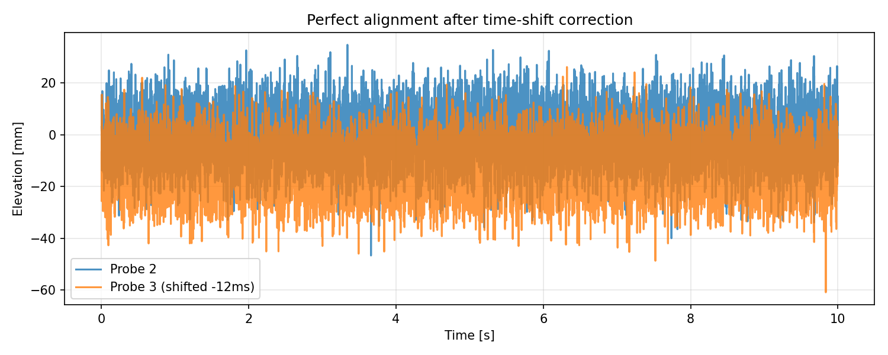

#  Wind‑Damping / Tank Diagnostics Report

## Data preview (first 5 rows)

name:        eta_1      eta_2      eta_3      eta_4
0  17.640523   3.300459 -19.395004 -10.776592
1   4.001572  -0.004800   7.388505  -8.422919
2   9.787380   8.181159  13.946845  -2.578078
3  22.408932   4.282137  -8.135850   7.120755
4  18.675580 -25.039473  -8.188220   5.457920 

## Raw amplitudes (before any fix)

  Probe 1: 23.3 mm  →  OK
  Probe 2: 23.7 mm  →  OK
  Probe 3: 23.2 mm  →  OK
  Probe 4: 23.2 mm  →  OK

## Probe‑amplitude & lag comparison

Result (6000‑7000 ms): {'lag_ms': 12.3}
Result (5000‑15000 ms): {'lag_ms': 12.3}

## Alignment plot

